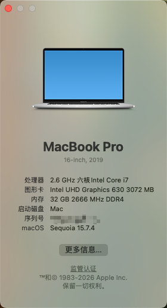
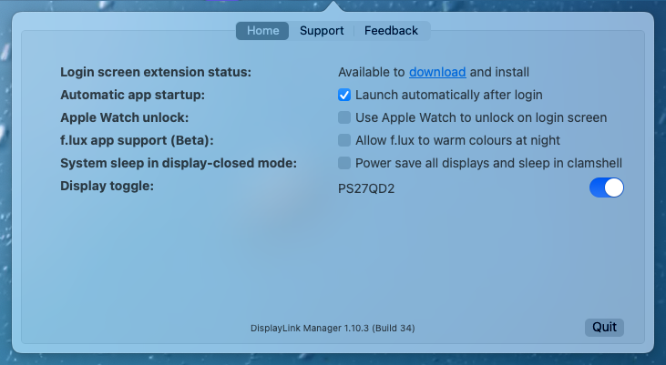
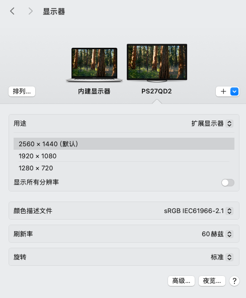
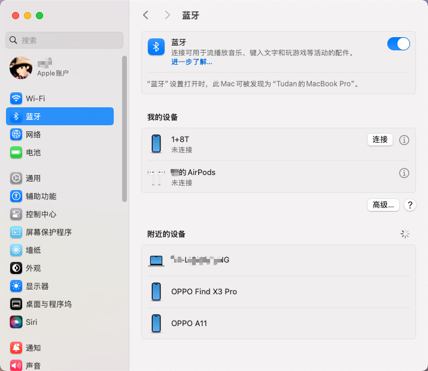

# Dell-Inspiron-7590-Hackintosh

用到的工具软件在 tools 目录

- Dell-Inspiron-7590 
- OC: 1.0.4

## 配置

| 类别                         | 型号                    |
| ---------------------------- | ----------------------- |
| CPU                          | Intel Core i7-9750H     |
| 核显                         | UHD Graphics 630        |
| 独显（不可用）                    | Nvidia Geforce GTX 1650 |
| 内存                         | DR4 2666Mhz 32 GB       |
| 声卡                         | Realtek ALC295          |
| 网卡&蓝牙                     | Intel Wireless-AC 9560  |

## 目录结构

```sh
.
├── LICENSE
├── README.md
├── Sequoia 15.0
│   └── EFI
│       ├── Boot
│       │   └── BOOTx64.efi
│       └── OC
│           ├── ACPI
│           ├── Bootstrap
│           ├── ComboJack
│           ├── Drivers
│           ├── OpenCore.efi
│           ├── Resources
│           ├── Tools
│           ├── config-1080.plist
│           ├── config-4k.plist
│           ├── config.plist
│           ├── config.plist.bak
│           ├── delloc
│           ├── kexts
│           └── oldConfig.plist
├── Sequoia 15.3.1 (省略)
├── imgs
│   ├── display-link-manager.png
│   ├── external-monitor.png
│   └── system-info.png
└── tools
    ├── DisplayLink Manager Graphics Connectivity1.10.3-EXE.pkg
    ├── Hackintool.zip
    ├── HeliPort.dmg
    └── OCAT_Mac.dmg
```

## Wi-Fi 可用

需要安装 HeliPort，设置开机启动，日常使用没啥问题

## HDMI/麦克风不可用问题

可以使用支持 DisplayLink 协议的扩展坞，例如 **联想 Thinkpad 40A8**，包括 hdmi、DP、千兆网口、3.5mm耳机接口（支持麦克风）

安装 DisplayLink Manager，可以支持最多两个外部显示器

## 三码洗白

将你的黑苹果洗为白苹果 https://www.bilibili.com/video/BV1454y167ML

## 修复HDMI/蓝牙教程

蓝牙已修复，可以正常使用，连接 AirPods 声音和麦克风均正常

参考资料

[https://github.com/vcvvvc/Dell-Inspiron-7590-Ventura-OpenCore/issues/6](https://github.com/vcvvvc/Dell-Inspiron-7590-Ventura-OpenCore/issues/6)

[https://hackintosh.club/d/10000017](https://hackintosh.club/d/10000017)

## 截图











