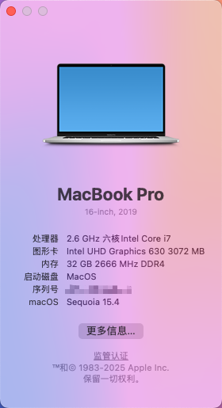

# Dell-Inspiron-7590-Hackintosh

用到的工具软件在 tools 目录

- Dell-Inspiron-7590 
- OC: 1.0.1

## 配置

| 类别                         | 型号                    |
| ---------------------------- | ----------------------- |
| CPU                          | Intel Core i7-9750H     |
| 核显                         | UHD Graphics 630        |
| 独显（不可用）                    | Nvidia Geforce GTX 1650 |
| 内存                         | DR4 2666Mhz 32 GB       |
| 声卡                         | Realtek ALC295          |
| 网卡&蓝牙                     | Intel Wireless-AC 9560  |

## Wi-Fi 可用

需要安装 HeliPort

## HDMI/麦克风不可用问题

可以使用支持 DisplayLink 协议的扩展坞，例如 **联想 Thinkpad 40A8**

安装 DisplayLink Manager，可以支持 hdmi、DP、3.5mm耳机接口（支持麦克风）

## 三码洗白

将你的黑苹果洗为白苹果 https://www.bilibili.com/video/BV1454y167ML

## 修复HDMI/蓝牙教程

参考资料，未测试

[https://github.com/vcvvvc/Dell-Inspiron-7590-Ventura-OpenCore/issues/6](https://github.com/vcvvvc/Dell-Inspiron-7590-Ventura-OpenCore/issues/6)

## 截图

